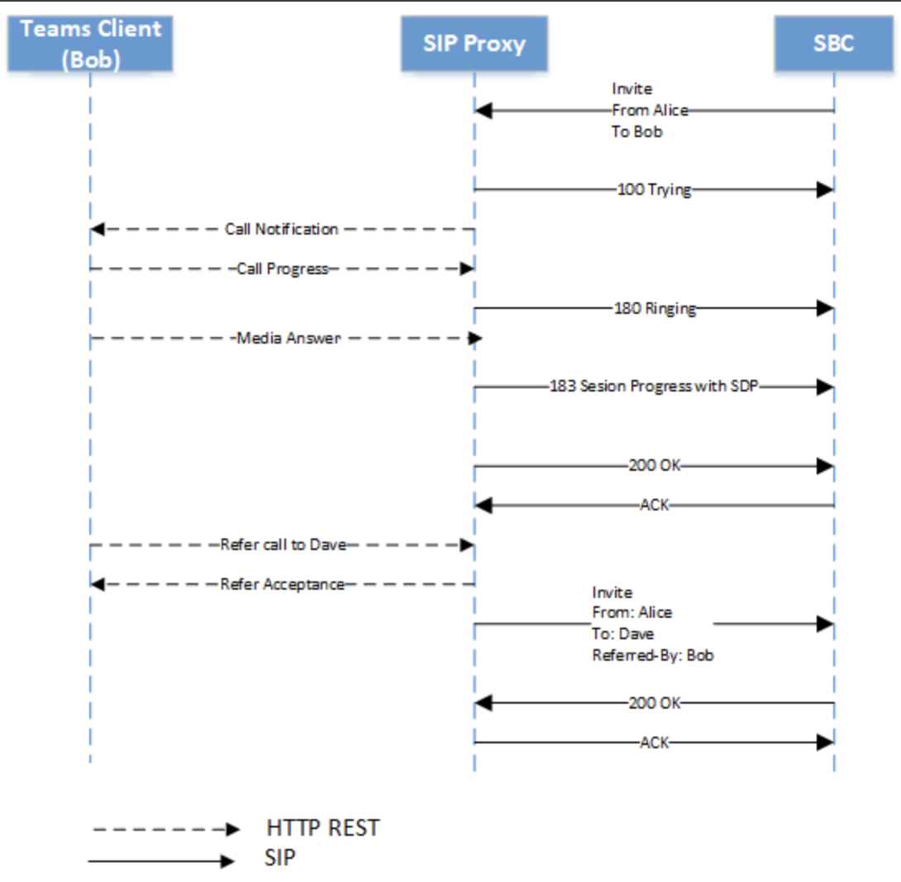

### 1. 설치 방법
#### - requirements.txt 기반 환경 설치 안내(Linux 기반)
##### (1) 가상환경 생성

```
python -m venv venv
source venv/bin/activate
```

##### (2) requirements 설치
```
pip install -r requirements.txt
```

##### (3) libreoffice 및 한글 폰트
```
apt-get update
apt-get install -y libreoffice fonts-noto fonts-nanum locales
fc-cache -fv
```

### 2. 실행 방법
```
./vl_.sh
```

```
python docx_parser.py \
--data_path /path/to/input.docx \
--output_path /path/to/output_dir
```

### 3. 시스템 설명
- **Word의 문단(Paragraph) / 표(Table)**를 순서대로 순회하면서 각 요소를 구분합니다.

- 이미지는 문단 및 표에 포함됩니다.

- 표 내부의 이미지도 개별 셀 위치와 함께 추출되며, 문서 전체 순서가 보존됩니다.

- 표 및 이미지는 Local LLM으로 요약 설명하며, 이미지에 텍스트가 있는 경우에는 텍스트를 추출합니다.

- LibreOffice를 이용해 .docx → .pdf 변환 후, pdfplumber로 페이지 정보를 추정합니다.

- Word가 렌더링한 페이지 정보(w:lastRenderedPageBreak)가 있다면 그것을 우선 사용합니다.

### 4. 데모 결과
```
[{'type': 'paragraph',
  'paragraph_index': 0,
  'page_number': 1,
  'markdown': '# 문서 개요 (Introduction)',
  'images': []},
 {'type': 'paragraph',
  'paragraph_index': 1,
  'page_number': 1,
  'markdown': '## 목적 (Objectives)',
  'images': []},
 {'type': 'paragraph',
  'paragraph_index': 2,
  'page_number': 1,
  'markdown': '본 문서는 당사의 25MY SBW 제어 시스템 소프트웨어에 대한 아키텍처 설계를 기술하기 위함이다. 시스템의 구성, 설계 결정 사항, 각 소프트웨어 모듈의 역할 및 인터페이스 정의를 통해 소프트웨어 구현의 일관성과 품질을 확보하는 것을 목적으로 한다.',
  'images': []},
 {'type': 'paragraph',
  'paragraph_index': 3,
  'page_number': 1,
  'markdown': '# 시스템 개요 (System overview)',
  'images': []},
 {'type': 'paragraph',
  'paragraph_index': 4,
  'page_number': 1,
  'markdown': '25MY SBW 시스템은 VCU(상위 제어기)로부터의 제어 신호를 수신하여 변속 동작을 수행하는 전자식 변속 시스템이다. 본 시스템은 운전자의 변속 의도를 반영하고, 차량의 상태에 따라 안전하게 구동되도록 설계되어 있다.',
  'images': []},
 {'type': 'paragraph',
  'paragraph_index': 5,
  'page_number': 1,
  'markdown': '',
  'images': [{'image_index': 0,
    'image_path': 'output/image_0.png',
    'location': 'paragraph_5',
    'ocr_text': 'ibd[block] PowerSubsystem [CAN Bus Description]\nepc: ElectricalPowerController\nfp: FS_EPC\nt: Transmission\nSN = sn89012\nfp: FS_TRSM\nice: InternalCombustionEngine\nfp: FS_ICE\nCAN_Bus\neepc: ~IFS_EPC\netrsm: ~IFS_TRSM\neice: ~IFS_ICE\npcu: PowerControlUnit',
    'markdown': '이 이미지는 CAN (Controller Area Network) 버스를 사용하여 전력 시스템의 구성 요소 간의 연결을 나타내는 블록도를 보여줍니다. 이 도면에는 전기 전력 컨트롤러, 전송 장치, 내연 엔진, 그리고 전력 제어 장치가 포함되어 있습니다.',
    'page_number': 1}]},
 {'type': 'paragraph',
  'paragraph_index': 6,
  'page_number': 1,
  'markdown': '그림 1 Internal block Diagram',
  'images': []},
 {'type': 'paragraph',
  'paragraph_index': 7,
  'page_number': 1,
  'markdown': '## 소프트웨어 컴포넌트 인터페이스 (Software module interface)',
  'images': []},
 {'type': 'paragraph',
  'paragraph_index': 8,
  'page_number': 1,
  'markdown': '### app_Asensing',
  'images': []},
 {'type': 'paragraph',
  'paragraph_index': 9,
  'page_number': 1,
  'markdown': 'app_Asensing 컴포넌트는 Motor 전류 값을 ADC로 센싱하고 평균 전류값을 산출하는 역할을 수행한다.',
  'images': []},
 {'type': 'paragraph',
  'paragraph_index': 10,
  'page_number': 1,
  'markdown': '#### 속성 (Attributes)',
  'images': []},
 {'type': 'table',
  'table_index': 0,
  'page_number': 1,
  'markdown': '| 컴포넌트 ID | SBW_SWC_001 |\n| --- | --- |\n| 개발 형태 (신규/재사용/수정재사용) | 신규 |\n| Related ID | SNR_002, SNR_101, SNR_120 |',
  'explanation': '이 표는 특정 컴포넌트의 정보를 제공하는 것으로 보입니다. 컴포넌트 ID는 SBW_SWC_001이며, 개발 형태는 신규로, 관련 ID에는 SNR_002, SNR_101, SNR_120가 포함되어 있습니다.',
  'images': []},
 {'type': 'paragraph',
  'paragraph_index': 11,
  'page_number': 1,
  'markdown': '#### 데이터 인터페이스 (Data interface)',
  'images': []},
 {'type': 'table',
  'table_index': 1,
  'page_number': 1,
  'markdown': '| 변수 | Data Type | Valid Range | Description |\n| --- | --- | --- | --- |\n| APP_ASENSING_H_ | 상수 | - | app_Asensing 헤더 중복 사용 방지를 위한 매크로 |',
  'explanation': "이 표는 특정 변수의 데이터 유형, 유효 범위 및 설명을 나타내는 정보를 제공합니다. 예를 들어, 'APP_ASENSING_H_'이라는 변수는 상수 데이터 유형으로, app_Asensing 헤더 중복 사용 방지를 위한 매크로로 사용됩니다. 이 변수는 유효 범위가 없으며, 해당 변수의 설명은 매크로의 목적을 설명하고 있습니다.",
  'images': []},
 {'type': 'table',
  'table_index': 2,
  'page_number': 1,
  'markdown': '| 변수 | Data Type | Valid Range | Description |\n| --- | --- | --- | --- |\n| USER_CUR_ADC_CNT | 상수 | - | 평균 전류값 산출을 위해 나누는 상수 |',
  'explanation': '이 테이블은 데이터의 변수에 대한 정보를 제공합니다. 각 변수는 데이터 타입, 유효 범위, 그리고 설명을 포함하고 있습니다. 예를 들어, USER_CUR_ADC_CNT는 상수로, 평균 전류값 산출을 위해 나누는 상수로 사용됩니다.',
  'images': []},
 {'type': 'paragraph',
  'paragraph_index': 12,
  'page_number': 1,
  'markdown': '## 기능 별 상호 작용 명세 (Interoperability per function)',
  'images': []},
 {'type': 'paragraph',
  'paragraph_index': 13,
  'page_number': 1,
  'markdown': '### 소프트웨어 일반 기능 (Software general functions)',
  'images': []},
 {'type': 'paragraph',
  'paragraph_index': 14,
  'page_number': 2,
  'markdown': '소프트웨어 일반 기능 요구사항에 대한 구현은 다음과 같은 함수 단위로 정의된다.',
  'images': []},
 {'type': 'paragraph',
  'paragraph_index': 15,
  'page_number': 2,
  'markdown': '#### 위치 초기화 학습',
  'images': []},
 {'type': 'paragraph',
  'paragraph_index': 16,
  'page_number': 2,
  'markdown': '##### 위치 초기화 학습',
  'images': []},
 {'type': 'table',
  'table_index': 3,
  'page_number': 2,
  'markdown': '| Function Name | 위치 초기화 학습 |\n| --- | --- |\n| Function Design ID | SW-FD– 0001 |\n| Function Objective | 모터 위치 초기화 |\n| Dynamic behavior |  |\n| Function Description | 소프트웨어는 시스템 초기화 완료 후 P단 위치가 확인되면 모터를 N단 방향으로 일정 거리만큼 이동시켜 기준 위치를 학습한다. 이 동작은 전원 인가 후 최초 1회 수행된다. |\n| Related ID | SFR_009, SFR_010, SFR_011 |',
  'explanation': '이 표는 특정 소프트웨어 함수의 설계와 동작을 설명하는 내용을 담고 있습니다. 주요 항목에는 함수 이름, 설계 ID, 목적, 동적 행동, 설명, 그리고 관련 ID가 포함되어 있습니다. 이 함수는 모터 위치 초기화를 위한 학습 과정을 수행하며, 이 동작은 시스템 초기화 후 처음에만 실행됩니다.',
  'images': [{'image_index': 1,
    'image_path': 'output/table_3_img_1.png',
    'cell': [3, 1],
    'ocr_text': 'Teams Client\n(Bob)\nSIP Proxy\nSBC\nInvite\nFrom: Alice\nTo: Bob\n100 Trying\nCall Notification\nCall Progress\n180 Ringing\nMedia Answer\n183 Session Progress with SDP\n200 OK\nACK\nRefer call to Dave\nRefer Acceptance\nInvite\nFrom: Alice\nTo: Dave\nReferred-By: Bob\n200 OK\nACK\nHTTP REST\nSIP',
    'markdown': '이 이미지는 SIP 프로토콜을 사용한 전화 연결 프로세스를 보여주는 시퀀스 도표입니다. Teams 클라이언트(Bob)가 Alice에게 전화를 걸고, SIP 프록시와 SBC를 통해 연결이 진행되는 과정이 명시되어 있습니다.'}]}]

```
